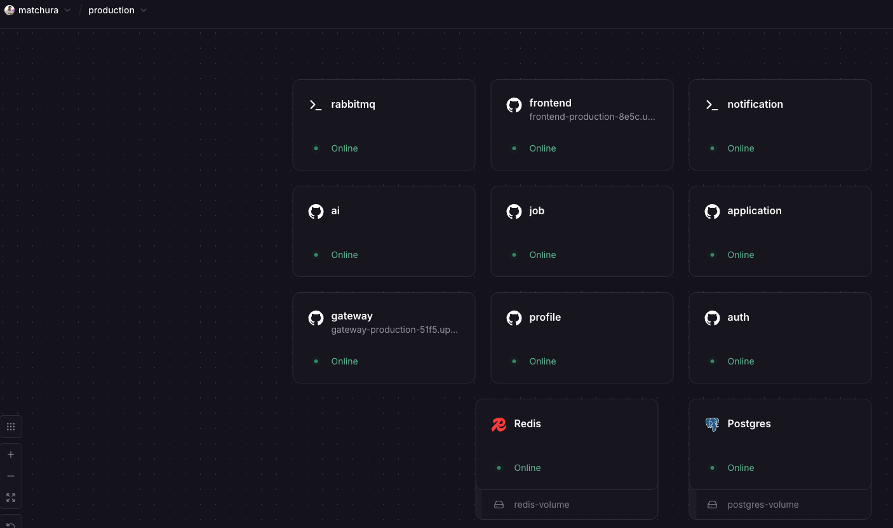
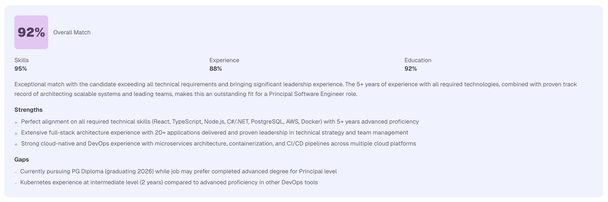
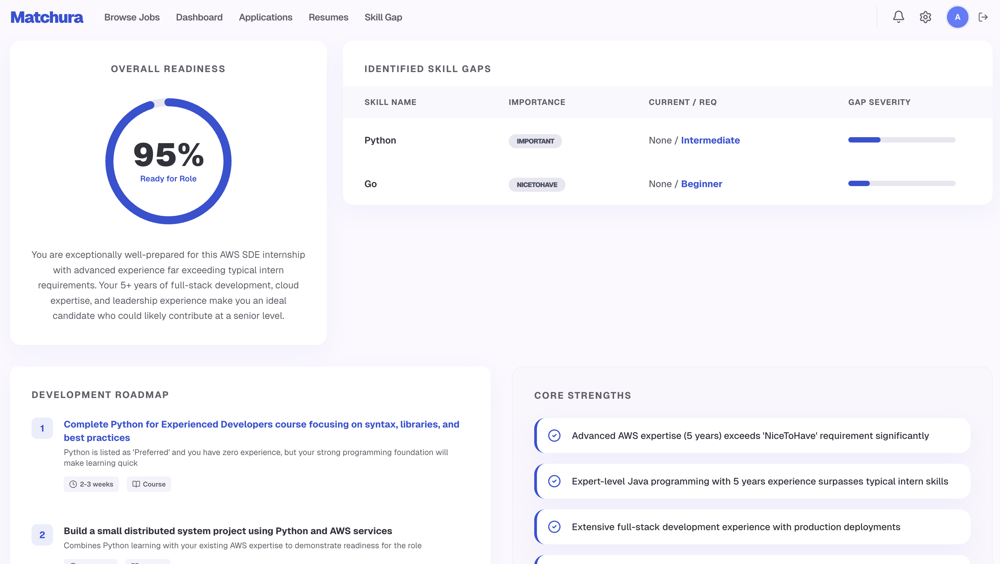

# Matchura — AI-Powered Job Matching Platform

An intelligent job matching platform built on a microservices architecture that uses Claude AI to parse resumes, compute candidate-job match scores, and perform skill gap analysis — delivering data-driven hiring decisions in real time.

## Screenshots

### Railway Production Architecture

All 11 services deployed and running on Railway: 7 microservices, frontend, API gateway, PostgreSQL, Redis, and RabbitMQ.

### AI Match Scoring

Candidates and employers see a detailed match breakdown with overall score, skill/experience/education sub-scores, strengths, and gaps.

### Skill Gap Analysis

Candidates get an AI-generated readiness report with identified skill gaps, importance levels, a development roadmap, and core strengths.

## Highlights

- **AI-Powered Matching** — Claude API agents parse resumes into structured data, score candidates against jobs (0-100 with breakdowns), and identify skill gaps with learning recommendations
- **7 Microservices** — independently deployable .NET 10 services communicating via RabbitMQ events and an API Gateway
- **Real-Time Notifications** — SignalR WebSocket hub pushes match results and application updates instantly
- **Async Resume Processing** — background workers extract text from PDF/DOCX uploads, parse via Claude, and cache results in Redis
- **Full Test Coverage** — unit tests for every service, integration tests with real databases, and Playwright E2E tests
- **Production Deployed** — CI/CD pipeline on GitHub Actions deploys to Railway with Sentry distributed tracing

## Tech Stack

| Layer | Technology |
|---|---|
| **Backend** | .NET 10, ASP.NET Core, Entity Framework Core |
| **Frontend** | Next.js 16, React 19, TypeScript, Tailwind CSS 4 |
| **Database** | PostgreSQL 16 (database-per-service) |
| **Cache** | Redis 7 |
| **Message Broker** | RabbitMQ 4 |
| **AI/LLM** | Claude API (Anthropic) |
| **File Storage** | AWS S3 |
| **Real-Time** | SignalR |
| **API Gateway** | YARP reverse proxy |
| **Monitoring** | Sentry (distributed tracing) |
| **CI/CD** | GitHub Actions → Railway |
| **Testing** | xUnit, Vitest, Playwright |

## Architecture

```
┌─────────────────────────────────────────────────────────────────┐
│                        Next.js Frontend                         │
│         React 19 · Zustand · Tailwind · SignalR Client          │
└────────────────────────────┬────────────────────────────────────┘
                             │
┌────────────────────────────▼────────────────────────────────────┐
│                     API Gateway (YARP)                           │
│          JWT Validation · Rate Limiting · Health Checks          │
└──┬──────────┬──────────┬──────────┬──────────┬──────────┬───────┘
   │          │          │          │          │          │
┌──▼───┐  ┌──▼───┐  ┌──▼───┐  ┌──▼───┐  ┌──▼───┐  ┌──▼────────┐
│ Auth │  │ Pro- │  │ Job  │  │ App  │  │ Noti-│  │    AI      │
│      │  │ file │  │      │  │      │  │ fic- │  │  Service   │
│ JWT  │  │      │  │Skills│  │Status│  │ation │  │            │
│ RBAC │  │Cand- │  │Taxo- │  │Track-│  │      │  │ Resume     │
│ Email│  │idate │  │nomy  │  │ing   │  │Signal│  │ Parser     │
│ Veri-│  │Empl- │  │Search│  │Notes │  │R Hub │  │ Job        │
│ fic- │  │oyer  │  │      │  │      │  │      │  │ Matcher    │
│ ation│  │      │  │      │  │      │  │      │  │ Skill Gap  │
└──┬───┘  └──┬───┘  └──┬───┘  └──┬───┘  └──┬───┘  └──┬─────────┘
   │         │         │         │         │         │
   ▼         ▼         ▼         ▼         ▼         ▼
┌──────┐  ┌──────┐  ┌──────┐  ┌──────┐  ┌──────┐  ┌──────┐
│auth  │  │prof  │  │job   │  │app   │  │notif │  │ai    │
│_db   │  │_db   │  │_db   │  │_db   │  │_db   │  │_db   │
└──────┘  └──────┘  └──────┘  └──────┘  └──────┘  └──────┘
               PostgreSQL 16 (database-per-service)

         ┌──────────────┐          ┌─────────┐
         │  RabbitMQ 4  │          │ Redis 7 │
         │  Event Bus   │          │  Cache  │
         └──────────────┘          └─────────┘
                    │
         ┌─────────▼──────────┐
         │      AWS S3        │
         │  Resume Storage    │
         └────────────────────┘
```

## AI Agent System

The AI Service runs three Claude-powered agents that process data asynchronously via background workers:

### Resume Parser Agent
Extracts structured data from PDF and DOCX uploads:
- Personal info, work experience, education history
- Skills with proficiency levels (Beginner → Expert) and years used
- Certifications, projects, and technical highlights

### Job Matcher Agent
Computes a match score (0-100) between candidates and jobs:
- **Skill Score** — exact matches + transferable skills
- **Experience Score** — years, industry relevance, seniority fit
- **Education Score** — degree alignment with requirements
- Returns strengths, gaps, and a plain-language explanation

### Skill Gap Analyzer Agent
Identifies what a candidate needs to qualify for a target role:
- Missing skills ranked by priority
- Learning recommendations and development paths

All agents include retry logic with exponential backoff, self-correction for malformed LLM responses, and Redis caching to avoid redundant API calls.

## API Gateway

YARP-based reverse proxy with tiered rate limiting:

| Route | Service | Rate Limit |
|---|---|---|
| `/api/auth/*` | AuthService | 30 req/min |
| `/api/profiles/*` | ProfileService | 100 req/min |
| `/api/jobs/*`, `/api/skills/*` | JobService | 100 req/min |
| `/api/applications/*` | ApplicationService | 100 req/min |
| `/api/matching/*`, `/api/skillgap/*` | AIService | 20 req/min |
| `/api/resumes/*`, `/api/documents/*` | AIService | 100 req/min |
| `/api/notifications/*` | NotificationService | 100 req/min |
| `/notifications-hub/*` | NotificationService (SignalR) | 100 req/min |

## Event-Driven Workflows

Services communicate through RabbitMQ events for loose coupling:

```
Employer publishes job
  → JobService emits JobPublishedEvent
    → AIService auto-matches all candidates
      → NotificationService pushes results via SignalR

Candidate uploads resume
  → AIService queues background parsing
    → ResumeParserAgent extracts structured data
      → Match scores recomputed for active jobs
```

## Quick Start

### Prerequisites

- Docker and Docker Compose
- .NET 10 SDK
- Node.js 20+

### Run everything

```bash
docker-compose up --build
```

This starts PostgreSQL (6 databases), Redis, RabbitMQ, all microservices, and the frontend.

### Verify services

```bash
curl http://localhost:5001/health   # Auth
curl http://localhost:5002/health   # Profile
curl http://localhost:5003/health   # Job
curl http://localhost:5004/health   # Application
curl http://localhost:5005/health   # AI
curl http://localhost:5006/health   # Notification
curl http://localhost:5010/health   # Gateway
```

### Database management

pgAdmin is available at `http://localhost:5050`
- Email: `admin@matchura.dev`
- Password: `admin`

### RabbitMQ management

`http://localhost:15672` — credentials: `matchura` / `matchura_dev`

## Project Structure

```
matchura/
├── .github/workflows/deploy.yml       # CI/CD → Railway
├── docker-compose.yml                 # Full local stack
├── src/
│   ├── services/
│   │   ├── AuthService/               # JWT auth, RBAC, email verification
│   │   ├── ProfileService/            # Candidate & employer profiles
│   │   ├── JobService/                # Job CRUD, skill taxonomy
│   │   ├── ApplicationService/        # Application pipeline & tracking
│   │   ├── AIService/                 # Claude agents, S3, background workers
│   │   │   ├── Agents/                # ResumeParser, JobMatcher, SkillGap
│   │   │   └── Infrastructure/
│   │   │       ├── BackgroundJobs/    # Async resume & matching workers
│   │   │       └── TextExtraction/    # PDF & DOCX extractors
│   │   ├── NotificationService/       # SignalR hub, RabbitMQ consumer
│   │   └── ApiGateway/               # YARP routing & rate limiting
│   ├── shared/
│   │   └── SharedKernel/              # Events, DTOs, Sentry extensions
│   └── frontend/web/                  # Next.js 16 app
│       ├── src/app/                   # App router pages
│       │   ├── (candidate)/           # Dashboard, applications, resumes, skill gap
│       │   ├── employer/              # Dashboard, job management, analytics
│       │   └── jobs/                  # Job browsing & detail
│       ├── src/components/            # UI, layout, features, composed
│       ├── src/stores/                # Zustand state management
│       └── e2e/                       # Playwright E2E tests
├── tests/
│   ├── *Service.UnitTests/            # Unit tests for all 6 services
│   ├── *Service.IntegrationTests/     # Integration tests (Job, App, AI)
│   └── Shared.TestUtilities/          # Common test helpers
├── scripts/                           # DB init, build helpers
└── k8s/                               # Kubernetes manifests
```

## Testing

```bash
# Run all backend tests
dotnet test

# Run frontend unit tests
cd src/frontend/web && npx vitest run

# Run E2E tests
cd src/frontend/web && npx playwright test
```

**Backend**: xUnit unit tests for every service + integration tests for JobService, ApplicationService, and AIService using real PostgreSQL and RabbitMQ containers.

**Frontend**: Vitest for component/unit tests, Playwright for end-to-end browser tests.

## CI/CD Pipeline

GitHub Actions workflow on push to `main`:

1. **Backend Tests** — restore, build, run unit + integration tests (.NET 10)
2. **Frontend Tests** — install, run Vitest (Node.js 22)
3. **Deploy** — Railway CLI deploys all 8 services
4. **Monitoring** — Sentry release created for distributed tracing

## Development

### Run a single service locally

```bash
dotnet run --project src/services/AuthService
```

### Run the frontend

```bash
cd src/frontend/web
npm install
npm run dev
```

### Environment variables

Copy `.env.example` to `.env` and configure:
- `ANTHROPIC_API_KEY` — Claude API key for AI agents
- `AWS_ACCESS_KEY_ID` / `AWS_SECRET_ACCESS_KEY` — S3 resume storage
- `JWT_SECRET` — shared signing key across all services
- `SENTRY_DSN` — error tracking

## License

This project was built as a capstone project.
